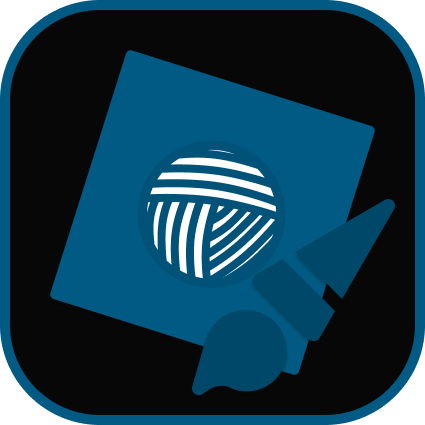

[[🔗Website/Dashboard]](https://roarn.space) | [[📘Documentation]](https://docs.roarn.space/studio) | [[📁 Source Code]](https://github.com/roarnpkg/studio)

Roarn Studio is a marketplace for the Roarn package manager making it easier to use on the Roblox Studio ecosystem

**Choose your Roarn ecosystem**

Rojo -> [Go to Rojo](https://github.com/roarnpkg/cli)

Roblox Studio -> _You're here!_

**Why Roarn?**

Using a tool like Roarn Studio will boost your productivity on your workspace. Roarn Studio will have all community made modules for you making your workspace cleaner and more efficient. Its all as simple as clicking a button!

When searching for packages in Roarn Studio it will give quick results on your search in seconds. In return it gives you the best packages to help your development.

**Installation**

Install in the Roblox Marketplace -> **[Install](https://www.roblox.com/library/8511080026/Roarn-Studio-Your-favorite-packages-in-one-place)**

If you still have issues on installing Roarn check out our [documentation](https://docs.roarn.space).

**Questions?**

If you have any questions on how Roarn Studio & Roarn works, please reply on this post! I'll be answering all questions here.

If you have more concerns or need help with Roarn we have community servers!

 | 

